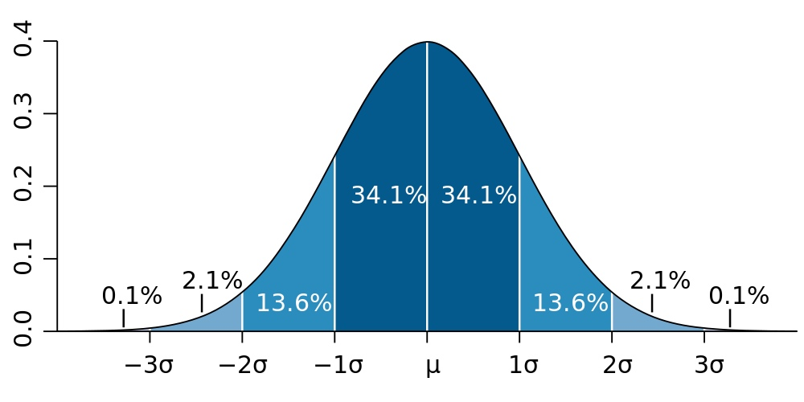
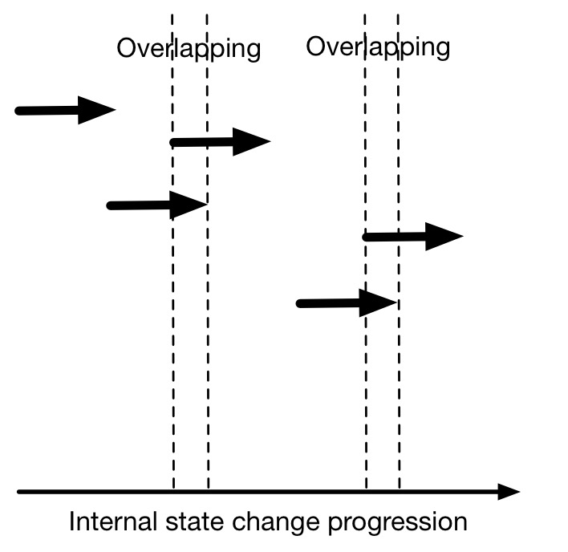
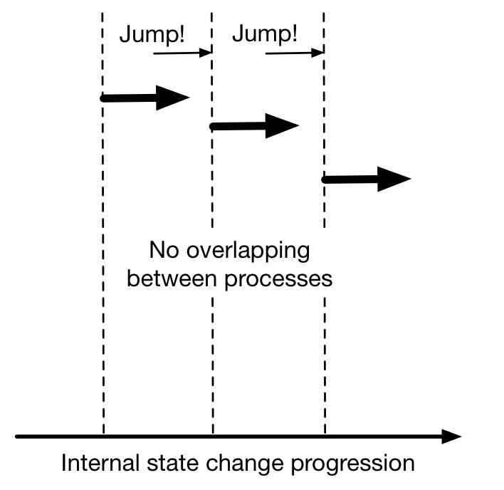
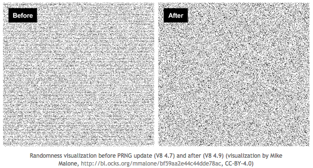

footer: Kenji Rikitake / Erlang User Conference 2016
slidenumbers: true

# Fifteen Ways to Leave Your Random Module

<!-- Use Deckset 1.6.0, Next theme, 16:9 aspect ratio -->
<!-- target: 25 slides -->

^ Good afternoon!

---

# Kenji Rikitake

9-SEP-2016
Erlang User Conference 2016
Stockholm, Sweden
@jj1bdx


^ Hi, my name is Kenji Rikitake. I'm very glad to be here in Stockholm for the first time in my life. I'm originally from Tokyo, Japan, and this is my first time at the Erlang User Conference, and eighth time on the Erlang Factory Series conferences.

---

# Past random number talks sponsored by Erlang Solutions

* [Erlang Factory SF Bay Area 2011: SFMT on Erlang](http://www.erlang-factory.com/conference/SFBay2011/speakers/kenjirikitake)
* [London Erlang User Group September 2013: Erlang PRNG](https://speakerdeck.com/jj1bdx/erlang-random-numbers-and-the-security)
* [Erlang Factory SF Bay Area 2015: Xorshift*/+ on Erlang](http://www.erlang-factory.com/sfbay2015/kenji-rikitake)

... so *fourth* presentation this time!

^ I've made three presentations on random numbers at three conferences sponsored by Erlang Solutions, in 2011, 2013, and 2015. This is the fourth presentation on the topic of the random number module handling in Erlang/OTP.

---

# So why I want you to leave the random module?

^ So why I'd like you to leave the random module right now?


---

# Random module is already deprecated in OTP 19.0 and will be removed in OTP 20!

^ Because the random module is already deprecated in OTP 19.0, and will be removed in OTP 20. OTP 20 will be coming next year in 2017. Our time is running out, and so does yours.

---

# AS183: the random module algorithm

* Originally written for 16-bit machines in 1982
* Relatively short period (6,953,607,871,644 = $$~2^{42.661}$$)[^1]
* Explorable in less than 9 hours with Intel Core i5 single core[^2]

[^1]: B. A. Wichmann, I. D. Hill, “Algorithm AS 183: An Efficient and Portable Pseudo-Random Number Generator”, Journal of the Royal Statistical Society. Series C (Applied Statistics), Vol. 31, No. 2 (1982), pp. 188-190, Stable URL: <http://www.jstor.org/stable/2347988>

[^2]: https://github.com/jj1bdx/as183-c

^ Historically the random module code is called AS183. AS183 is published in 1982, designed for 16-bit computers, and has a relatively short period of approximately two to the power of 43. On 2014, I've shown a proof-of-concept code exploited this in less than 9 hours with C. So I have to conclude AS183 is no longer safe.

---

# AS183 code on FORTRAN

Microsoft's implemantation on Excel 2003[^3]:

```fortran
C     IX, IY, IZ SHOULD BE SET TO INTEGER VALUES
C     BETWEEN 1 AND 30000 BEFORE FIRST ENTRY
      IX = MOD(171 * IX, 30269)
      IY = MOD(172 * IY, 30307)
      IZ = MOD(170 * IZ, 30323)
C23456 AMPERSAND SHOWS LINE CONTINUATION
      RANDOM = AMOD(FLOAT(IX) / 30269.0 +
     &         FLOAT(IY) / 30307.0 +
     &         FLOAT(IZ) / 30323.0, 1.0)
```

[^3]: Description of the RAND function in Excel, <https://support.microsoft.com/en-us/kb/828795>, modified by Kenji Rikitake for better readability (and FORTRAN 77 compatibility)

^ This is a piece of code for AS183 in FORTRAN. It's surprising to know that Microsoft also implemented an AS183 algorithm to Excel 2003 and showed this one in their documents. I chose FORTRAN because this was my first programming language in 1974. You can find a similar code in the random module.

---

# Issues of the random module

* AS183 is no longer safe in 2016; the period is too short
* *Without explicit seeding the result is always the same*
* Seeding with `erlang:now/0` can be easily exploited

```erlang
%%% erlang:now/1 is also deprecated since 18.0!
_ = random:seed(erlang:now()). % DON'T DO THIS!
```

^ Erlang's random module has three issues. The period of algorithm AS183 is simply too short. And you need to explicitly give the initial state, or seed, to the function. Otherwise it will always start from the same default seed value, and that is very bad, because it gives the predictability. Also, many people still seed the function with the deprecated erlang:now function, and this is also a very bad practice, because the seeding value can be easily guessed from the current time. 

---

# Think about the purpose of the randomness before using

* Security? Generating passwords or keys?
* Simulation? Needs a long period?
* Compatibility with older OTP 17.x or before?

^ Before getting into the details of leaving the random module, you need to think about the purpose of the randomness which you want. If it is for security, use a secure generator. For simulation, choose a generator with longer periods. If your code need to run either before or after rand module, or OTP 18.0, you need to think about the conditional implementation.

---

# Let's get down to the recipes

^ OK let's get down to the business.

---

# #1: Check the compile-time error message of deprecated functions

In OTP 19.0 or later, the compiler generates the warnings as in
`otp_internal:obsolete/3`:

```erlang
obsolete_1(random, _, _) ->
    {deprecated, "the 'random' module is deprecated; "
     "use the 'rand' module instead"};
```

^ First of all, you can find out the usage of now-deprecated random module, by compiling the code. Here's the source code where compiler detects the obsoleteness.

---

# #2: Use crypto module for secure random number generation

* `crypto:strong_rand_bytes/1`
* OpenSSL `RAND_bytes()` wrapper

```erlang
1> crypto:strong_rand_bytes(10).
<<3,63,210,4,69,106,175,117,160,139>>
2> crypto:strong_rand_bytes(10).
<<69,169,134,65,238,118,51,203,47,125>>
```

^ If you need a randomly-generated strong password or a key, use crypto module, which is a wrapper of OpenSSL. OpenSSL indeed has a lot of problems, but it's still better than your own written piece of code in most cases.

---

# #3: Use `/dev/urandom` for security

`/dev/urandom` is *not a regular file*[^4]

```erlang
1> Size = 10.
10
2> Cmd = lists:flatten(io_lib:format(
         "head -c ~p /dev/urandom~n", [Size])).
"head -c 10 /dev/urandom\n"
3> list_to_binary(os:cmd(Cmd)).
<<58,133,170,67,160,90,91,165,56,91>>
4> list_to_binary(os:cmd(Cmd)).
<<201,14,233,86,15,47,168,96,85,61>>
```

[^4]: See <https://azunyanmoe.wordpress.com/2011/03/22/reading-device-files-in-erlang/> for the detailed explanation

^ If you don't trust OpenSSL, you can directly fetch random values, from the operating system interfaces. A popular one is /dev/urandom, though it's not a regular device so you need an Erlang Port program to fetch the data. The command may fail so you need to have an error recovery code.

---

# #4: Use entropy-supplying system calls for security

* Linux (and Solaris) has `getrandom()` and `getentropy()`
* FreeBSD has `sysctl` MIB `KERN_ARND`/`kern.arandom` as:

```erlang
%%% For FreeBSD only: Linux and Solaris need C code
9> list_to_binary(os:cmd("sysctl -X -b -B 10 kern.arandom\n")).
<<18,231,137,93,134,250,30,219,244,149>>
10> list_to_binary(os:cmd("sysctl -X -b -B 10 kern.arandom\n")).
<<188,136,104,118,223,21,21,142,121,225>>
```

^ Entropy-supply system calls are often better than using /dev/urandom because they do not block and can directly access the entropy pools of the operating systems. Linux and Solaris has getrandom() and getentropy() C functions. OTOH FreeBSD implements it as a sysctl MIB, and can be called as an operating system command shown in this slide.

---

# #5: Use hardware random number generator for security

* Entropy generated in computers especially servers is low[^5]
* Use external generator (with physical sources) such as: avrhwrng[^6] / NeuG[^7] / ChaosKey[^8]

[^5]: Bruce Potter, Sasha Wood, [Managing and Understanding Entropy Usage (pdf)](https://www.blackhat.com/docs/us-15/materials/us-15-Potter-Understanding-And-Managing-Entropy-Usage.pdf) (presented at BlackHat USA 2015 conference)

[^6]: Arduino UNO R3 + noise generator board: https://github.com/jj1bdx/avrhwrng/

[^7]: STM32F103 USB dongle: https://www.gniibe.org/memo/development/gnuk/rng/neug.html

[^8]: STM32F043 USB dongle: http://altusmetrum.org/ChaosKey/

^ For maintaining a high-quality secure random number feed from the operating system, you need to supply enough random bits, or entropy, to the OS. This is not adequately done just by running a computer, especially a server, even worse on a virtualization environment. Adding an external random bit generator from physical sources will effectively solve the problem.

---

# avrhwrng v2rev1

* A shield for Arduino UNO R3 (and other compatible boards)
* Two digital random outputs from independent avalanche noise diodes and the amplifiers
* Generates ~80kbps with USB serial 115200bps port
* Design finalized on June 2016
* [Source on GitHub](https://github.com/jj1bdx/avrhwrng/)


^ Let me introduce you my own Arduino UNO R3 shield device for generating physical random numbers. I've been testing this since 2008, and have built five modules of this. Connecting this device to FreeBSD servers have given very good results for weeks. The source code, schematics, and all the technical details are on GitHub.

---

# #6: Seeding rand module is different from seeding random module

^ I have been asked a lot about the difficulties on how to seed the rand modules. The semantics are indeed changed from the random module. So I will explain it in details here.


---

# #6.0: Seeding in per-process and functional APIs

* `rand:uniform/{0,1}` uses *per-process* seeding: the seed is in the *process dictionary*
* `rand:uniform_s/{1,2}` uses *functional* interface: the seed is given *in the function argument*
* These are the same in `random` module too

^ The rand and random modules have two different sets of APIs. The first one uses per-process seeding, which stores the seed in the process dictionary. The other one is the functional API, giving the seed in the function argument.

---

# #6.1: random module needs *explicit and different* seeding for each process

* `random:seed/0` returns *a fixed value*: *explicit* seeding for each process as followis is *required*:

```erlang
%%% Don't use erlang:now/0; use this for OTP 18.0 and later
random:seed({erlang:phash2([node()]),
             erlang:monotonic_time(),
             erlang:unique_integer()})
```

^ Random module seed/0 has a flaw that it always returns the same value. So explicit seeding for each process is required, with time-related functions, or even cryptographic functions.

---

# #6.1: Per-process API functions in rand module is *automatically seeded* on the first call

* You *do not need to call* `rand:seed/{1,2}` if you decide to use the process dictionary for storing the state
* For every process the seed is *different from each other* when it is automatically initialized in this way

^ OTOH, in rand module, you do not need to call the seeding function explicitly, if you use the process dictionary. The initial seeding will be done automatically at the first call with the time-related functions available since OTP 18.0. So in many cases you can simply remove the seeding function for the rand module.

---

# #6.2: Seeding in `random:seed/3` no longer works in `rand:seed`

```erlang
%%% Don't do this: this will fail
rand:seed(100, 200, 300) % no rand:seed/3 defined
%%% Do this
rand:seed(exsplus, {100, 200, 300}) % needs algorithm
%%% If you need the explicit state, use rand:seed_s/2
rand:seed_s(exsplus, {100, 200, 300}) % needs algorithm
```

^ Also, you need to be aware of the seeding function argument difference between random and rand modules. The `seed/3` function no longer exists in rand module; and in rand module you need to give the algorithm name with the seeding parameter tuple. Please refer to the OTP manual for the details.

---

# #6.3: Do not assume the seed is stored as tuples on rand module!

* On rand module, seeds are *algorithm dependent*
* Seeds have *internal* and *external* format
* Internal format: algorithm handler and the seed
* External format: algorithm name (atom) and the seed

^ On random module, the seed was a three-member tuple. On rand module, the seeds are dependent on the algorithm, and have two different formats, internal and external. The internal format has the actual alrogithm handler and the seed value, and the external one has the alrogithm name atom and the seed.

---

# #6.3.1: Internal seed format

```erlang
1> S = rand:seed_s(exsplus, {100, 200, 300}).
{#{max => 288230376151711743,
next => #Fun<rand.8.41921595>,
type => exsplus,
uniform => #Fun<rand.9.41921595>,
uniform_n => #Fun<rand.10.41921595>},
 [288090199732603799|1900797102015]}
```

^ This shows an example of the internal seed of rand module. It's actually a two-member tuple, of a handler which consists of a map structure, and the seed, represented in a two-member list for exsplus.

---

# #6.3.2: Use external format to transfer the state inside the process dictionary

```erlang
2> ES = rand:export_seed_s(S).
{exsplus,[288090199732603799|1900797102015]}
3> S =:= rand:seed_s(ES).
true
4 > rand:seed(ES), rand:export_seed() =:= ES.
true
```

^ The rand module have functions to export and import seeds with the external format. the `export_seed_s/1` returns the given seed in the external format, which can be imported by either `seed_s/1` or `seed/1`. The seed in the process dictionary can be obtained with `export_seed/0` function as well. Using these functions ensure that both the algorithm and seed are correctly transferred.

---

# #7: Use default algorithm `exsplus` if you don't have other needs

* rand module have three [Xorshift\*/+](http://xoroshiro.di.unimi.it/) algorithms
* Default `exsplus` is fast, sufficient in most use cases
* `exsplus`: Xorshift116+, 58 bits, period: $$(2^{116}-1)$$
* `exs1024`: Xorshift1024*, 64 bits, period: $$(2^{1024}-1)$$
* `exs64`: Xorshift64*, 64 bits, period: $$(2^{64}-1)$$

^ If you have no specific reason to choose the algorithm in the rand module, use the default exsplus, which is specifically designed for Erlang 64-bit BEAM limitation and maintaining the execution speed. The period of exsplus is two to the power of 116. There are other two algorithms, exs1024 and exs64.

---

# #8: Try exs1024 algorithm of rand module for simulation

* Longer periods are required for high-precision simulation
* `exs1024` has a sufficiently longer period than exsplus
* `exs1024` takes less than x2 execution time than `exsplus`

^ For a high-precision simulation purpose which requires a longer period, exs1024 will give a better result. The period is much longer, which is two to the power of 1024, and the execution time is only a bit more longer than twice as exsplus, according to our benchmarking test during the module development.

---

# #9: Use rand:normal/0 for normal distribution

* `rand:normal/0` gives normal distribution output $$x$$ of $$\sigma{}=1$$ (standard deviation) and $$\mu{}=\bar{x}=0$$ (mean value), based on fast ziggurat algorithm
* Normal distribution represents [central limit theorem](https://en.wikipedia.org/wiki/Central_limit_theorem), where sums independent random variables follow

^ Rand module has a great new feature, which is a function returns the normal distribution output. Normal distribution can be used for estimating errors of natural phenomena and other real-world behaviors.

---

# Normal distribution[^9]



[^9]: By Mwtoews [[CC BY 2.5](http://creativecommons.org/licenses/by/2.5)] via Wikimedia Commons<br><https://commons.wikimedia.org/wiki/File%3AStandard_deviation_diagram.svg>

^ This is a graph of normal distribution. The probability of mean values of the sums by adding the numbers shown on randomly thrown six-face dice will highly likely to be converged like into this graph, where the mean value will be 3.5.

---

# #10: Use SFMT for a hard-core long-time simulation

* A typical [SIMD-oriented Fast Mersenne Twister (SFMT)](http://www.math.sci.hiroshima-u.ac.jp/~m-mat/MT/SFMT/) algorithm has the period of $$(2^{19937}-1)$$
* The *extremely* long period may affect the results if the number of random samples is huge
* [`sfmt-erlang`](https://github.com/jj1bdx/sfmt-erlang/) is a NIF-based implementation of 32-bit output streams and `rand`/`random` module compatible

^ If you are really into running a simulation with huge number of samples for a long time, SIMD-oriented Fast Mersenne Twister, or SFMT, will be a good generator for you. The period is two to the power of 19937, which is extremely long. I've published an implementation on GitHub, which is as fast as the random module with NIFs. I also publish the pure Erlang version for those who want slower but safer code. This implementation is also available in the hex package manager.

---

# #11: Check orthogonality of random generators for concurrent/parallel operations

* Each process must generate orthogonal sequences
* Use jump functions for ensuring orthogonality on [Xorshift\*/+](http://xoroshiro.di.unimi.it/) ([exsplus116](https://github.com/jj1bdx/exsplus116) and [exs1024](https://github.com/jj1bdx/exs1024) are jump-function ready)
* [`tinymt-erlang`](http://github.com/jj1bdx/tinymt-erlang/) can choose $$~2^{58}$$ parameters [($$2^{28}$$ subset available here)](https://github.com/jj1bdx/tinymtdc-longbatch/) (period: $$(2^{127}-1)$$, 32-bit output)

^ If you use the concurrently generated random numbers in the same task, each process must generate orthogonal sequences. In other words, the sequences may overlap and will give you a bad result if you don't seed carefully. To ensure non-overlapping sequences, there are two ways: using jump functions so that two arbitrary sequences guarantee the distance between the internal state space, or choosing different generation parameters for the orthogonality. For Xorshift\*/+ alrorithms, jump functions are available, which I recently wrote a pure-Erlang prototype. For TinyMT-Erlang, I've computed more than 200 million parameter sets, and they're on GitHub. And the TinyMT algorithm is available on the hex package manager too.

---



^ This is a simple example of how overlapping of internal state progression happens. When you randomly choose the initial states, the result may overlap. When you use jump functions during the initialization phase, the result will not overlap so long as the number of elements of the generated sequence does not exceed the length of jumping.

---

# #12: Use non-random external modules for OTP 17.x or before

* Use [exsplus116](https://github.com/jj1bdx/exsplus116), [exs64](https://github.com/jj1bdx/exs64), [exs1024](https://github.com/jj1bdx/exs1024) (with HiPE for speed)
* [`sfmt-erlang`](https://github.com/jj1bdx/sfmt-erlang/) and [`tinymt-erlang`](http://github.com/jj1bdx/tinymt-erlang/) also work
* For proper seeding (from [LYSE](http://learnyousomeerlang.com/buckets-of-sockets)):

```erlang
%% properly seeding the process
<<A:32, B:32, C:32>> = crypto:strong_rand_bytes(12)
random:seed({A,B,C}).
```

^ If you have to stick with OTP 17 or older, consider using external modules implementing the better random number algorithms. Those in OTP 18 or later rand module are all available. You can use SFMT and TinyMT too. Use `crypto:strong_rand_bytes/1` for properly seeding the functions.

---

# #13: Use wrappers for encapsulating the changes of random and rand modules

* With [Tuncer Ayaz's `erlang-rand-compat` module](https://github.com/tuncer/erlang-rand-compat), you can use `rand` if available, or fall back to `random` if not
* Examples: [triq](https://github.com/krestenkrab/triq/pull/61), [rebar](https://github.com/rebar/rebar/pull/612)
* Rewriting code is still better, though (see [a rebar3 commit](https://github.com/erlang/rebar3/commit/be79259e324e66ac2f948aed186474cb06a2ea85))

^ Also, if you do have to make your application compatible with both random and rand modules, you can use a wrapper. Tuncer Ayaz has built a wrapper module called `erlang-rand-compat`, which uses rand module if available, or fall back to random module if not. He's put the code in triq and rebar too. I think, however, rewriting the code is still better, even with a conditional compilation. See rebar3 for the latest details.

---

# #14: Implement your own modules for compatibility with old OTP versions (should be done *very* carefully)

* [Jean-Sébastien Pédron](https://github.com/dumbbell/) did this on [RabbitMQ](https://github.com/rabbitmq/rabbitmq-server/issues/860)
* Example: [`src/rand_compat.erl` in rabbitmq-common](https://github.com/rabbitmq/rabbitmq-common/commit/76f0dbb6666c02d3bd7b7b1727cb1ba0af927829)
* Similar [solution for time functions](https://github.com/rabbitmq/rabbitmq-server/issues/346): [erlang-time-compat](https://github.com/dumbbell/erlang-time-compat)


^ On RabbitMQ, the compatibility between running OTP versions are provided through the dynamically-loaded modules. Recently they've added their own compatibility module for the random numbers. If you try to implement your own modules, however, you should do it very carefully. I'd rather recommend to migrate to a newer module.


---
# #15: If you do need to write your own code and algorithm, check at least stochastic and statistic consistency and quality

* Use checking tools: [ent](http://www.fourmilab.ch/random/), [Dieharder](http://www.phy.duke.edu/~rgb/General/dieharder.php), [TestU01](http://simul.iro.umontreal.ca/testu01/tu01.html)
* Metrics: entropy, statistic estimators, pattern detection
* Measure at least for 1Gbytes, or even more

^ In some rare cases, you need to write your own random number generation alrogithms. You cannot theoretically prove a generated sequence is random anyway, but at least you must check the stochastic or statistical characteristics of the sequence. There are many tools and metrics already. I suggest you to measure at least one gigabytes or even more output each time, and try it many times repeatedly, for determining you're choosing the right path.

---



# Failure example: JavaScript V8 Engine[^10]

[^10]: ["There's Math.random(), and then there's Math.random()", V8 JavaScript Engine blog, 17-DEC-2015](http://v8project.blogspot.jp/2015/12/theres-mathrandom-and-then-theres.html)

^ To conclude this presentation, I'll show you another case of random number generation failure. At Erlang Factory SF Bay 2011, I chose a PHP5 case for the Windows. This time, I'll show you a case of V8 JavaScript Engine, which was fixed on December 2015. In short, they were using an algorithm called MWC1616, which didn't have enough length of period which could be as small as 40 million or even less, and failed a test suite of TestU01, which I introduced in the former presentation page.

---


^ Let's see the difference. The old one on the left showed visible horizontal lines. The new one, actually generated by Xorshift128+ algorithm, does not have such a problem. The good thing was that the V8 development team fixed the bug. And even better thing was that Erlang rand module released on May 2015 had fixed this issue at least six months before the V8 Team did! 

---

# Summary: Use rand module *now*

* There are already many ways and code samples to migrate to rand module from random module
* For security, use crypto module or `/dev/urandom`, preferably with hardware random number generators
* If you can't use 18.0 or later, **stop using random module** and use newer random number generator algorithms
* **Test your code before releasing it into production!**

^ Let me summarize the presentation. I strongly suggest you to use rand module now. There are already many ways of migration from random to rand module. If you're security conscious, use crypto module or `/dev/urandom`, with a hardware random number generator. If you don't use OTP 18 or later, please stop using random module, and use a newer algorithm, available as an external module. And for the general warning: do test your code before releasing it!


---

# Acknowledgment

* Dan Gudmundsson - rand module principal developer
* Sebastiano Vigna - [Xorshift\*/+](http://xoroshiro.di.unimi.it/) inventor
* Erlang Solutions
* ... and you all!
* Slides at <https://github.com/jj1bdx/euc2016-erlang-prng/>


^ I'd like to thank Dan Gudmundsson for his contribution to the rand module overall development and as a rigorous Erlang code optimizer, Sebastiano Vigna for kindly testing and providing the Xorshift116+ algorithm for Erlang BEAM which actually was requested by Dan, and Erlang Solutions for giving me many chances of talking about this topic. Without those people, the rand module would have never come into being.

---

# [fit] Thank you

# [fit] Questions?

^ Thank you!
